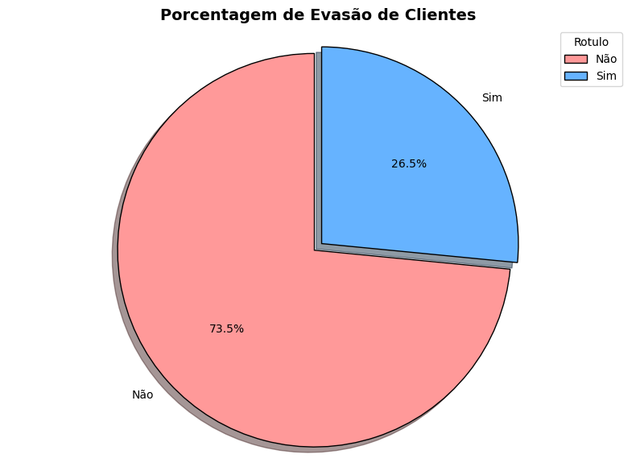
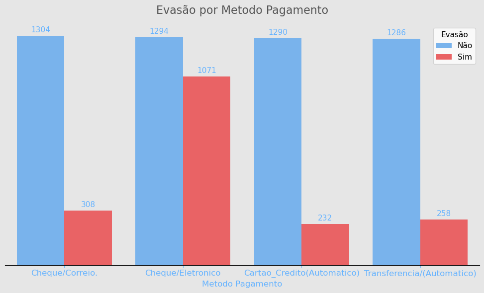
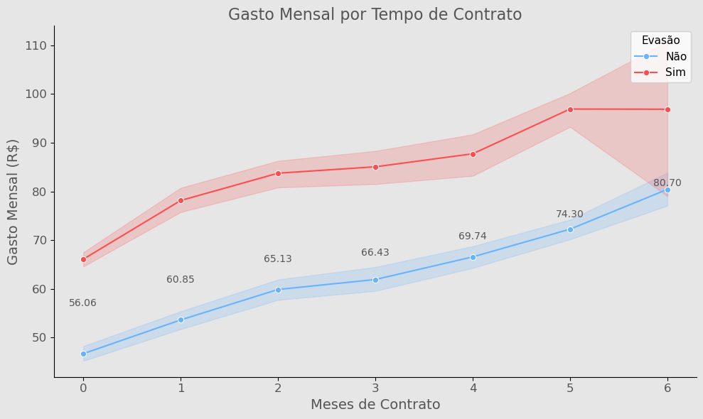

# Empresa-Telecom X 

# Análise de Evasão dos Clientes. 
* [Introdução](#Introdução)
* [Objetivo do Projeto](#objetivo)
* [Etapas](#etapas_etl)
* [Pessoas Desenvolvedoras do Projeto](#contato)
* [Precisa de ajuda? É so chamar](#Contato)
* [Conclusão](#conclusão)
---
## Introdução

- **🚀 Visão Geral**


Este projeto, desenvolvido por **Luis Goni** (GitHub: [@luisgoni](https://github.com/luisgoni/Projeto_Evas-o_Clientes_Part_1)), tem como objetivo a análise exploratória e preditiva do *churn* (evasão de clientes) da empresa fictícia **Telecom X**. 

A partir de dados JSON reais, o projeto realiza um estudo completo que envolve desde o carregamento e a limpeza dos dados até a criação de modelos de machine learning para previsão de cancelamentos. O resultado final está preparado para Analises mais profundas.Que serão feitas nos proximo projeto.(Part2)

---
## Contexto em que fui Contratado.

- Assistente de análise de dados na empresa Telecom X e vou fazer parte do projeto "Churn de Clientes". A empresa enfrenta um alto índice de cancelamentos e precisa entender os fatores que levam à perda de clientes.
--- 
## Objetivo 
- O projeto aborda a evasão de clientes em uma empresa de telecomunicações, destacando a importância da limpeza, tratamento e análise exploratória de dados (EDA).O objetivo é preparar os dados para análise, identificar padrões e gerar insights que possam orientar estratégias para reduzir a saída de clientes, aplicando conhecimentos e habilidades adquiridas no curso.
---
## Etapas_ETL

Os dados foram obtidos de um arquivo JSON e processados utilizando a biblioteca Pandas. As principais etapas de limpeza e tratamento incluíram:
- Normalização
- Tratamento de Valores Nulos ou ausentes.
- Padronização dos Dados.
- Conversão dos tipos de Dados, para melhor acuracia.
---
<h4 align="center">

 :construction:  Projeto em construção  :construction:

</h4>


# 📁 Acesso ao projeto
**🔗 Acesse o projeto completo aqui:**  
👉 **[Git_Hub](https://github.com/luisgoni/Projeto_Evas-o_Clientes_Part_1)**

# 🛠️ Ferramentas e Tecnologias Utilizadas
- **Linguagem:** Python 🐍  
- **Bibliotecas Principais:**  
  - `Pandas`  
  - `Seaborn`, `Matplotlib` & `Plotly`
  - `Requests` 
  - `JSON`   
- **Ferramentas Auxiliares:**  
  - VsCode / Google Colab (Ambiente de desenvolvimento)  
  - Trello Gestão de tarefas
### Contato

📧 Em caso de dúvidas, entre em contato! 

[**Luis Gustavo(Goni)**](https://github.com/luisgoni/Projeto_Evas-o_Clientes_Part_1/blob/main/Projeto_Analisando_Clientes_Evas%C3%A3o.ipynb)  

[](https://www.linkedin.com/in/luisgoni-amaral/)


### Conclusão 

- Ao realizar esse desafio, eu apliquei  conhecimentos essenciais para a análise de grandes volumes de dados em um contexto real, onde minhas descobertas impacta diretamente as estratégias da empresa para melhorar o principal problema que estão tendo.

- A análise revelou que os principais fatores associados ao churn na Telecom X incluem:

* Contratos Mensais: Clientes com contratos de curto prazo apresentam uma probabilidade significativamente maior de cancelar.
* Tempo de Contrato (Tenure): Clientes novos com pouco tempo de contrato são mais suscetíveis ao churn.
* Encargos Mensais: Clientes com encargos mensais mais altos tendem a ter uma maior probabilidade de churn.
* Senioridade: Idades mais alta requer atenção dobrada, pois pede por adaptações com o tempo.

## Recomendações
- Com base nos insights, recomendamos as seguintes ações para a Telecom X:
* Segmentação de Clientes: Identificar clientes em maior risco de churn e direcionar campanhas de retenção personalizadas.
* Foco na Retenção de Clientes Novos: Implementar programas de integração e acompanhamento nos primeiros meses.
* Incentivo a Contratos de Longo Prazo: Oferecer benefícios atraentes para clientes que optarem por contratos anuais ou bienais.
* Análise de Preços: Avaliar a estrutura de preços dos planos, especialmente para os de maior custo.


### Algumas visualizações realizadas no projeto.

### Analise de evasão por metodo de pagamento.


### Analisando Gasto Medio Mensal.



### Executando o projeto no Google Colab.

1. Faça upload do arquivo `.ipynb` para o Google Colab
2. Execute a primeira célula para instalar dependências:
```python
!pip install pandas numpy matplotlib seaborn requests json
```
3. Execute as células sequencialmente.
4. Assim você pode ter o mesmo resultado que eu, e tirar suas conclusões.


---

Desenvolvido como parte do curso de Data Science da **Alura/Oracle**.

---
<h4 align="center">

 :construction:  Projeto em construção  :construction:
</h4>